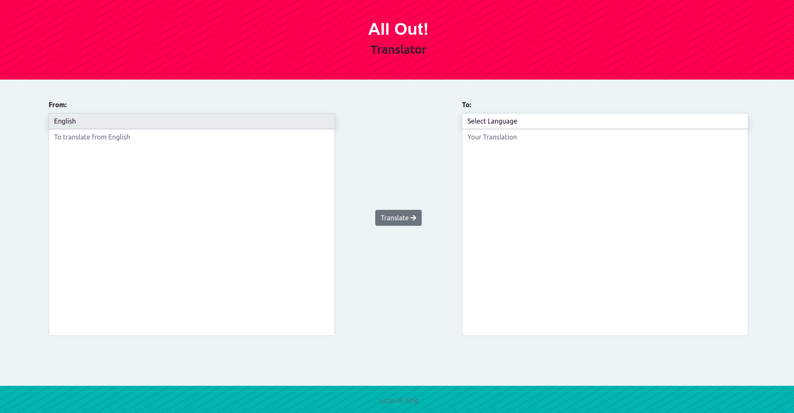

<h1 align="center">All Out! Translator</h1>

### Created using:

* React
* BootstrapReact
* CSS
* Fontawesome

## Installation Process

### Install Node

[NodeJS](https://nodejs.org/es/download/)

### Install Dependencies

Run in terminal

`npm install`

## Run App

To start the app run in the terminal

`npm start` 

it will run an instance of the app in  

[http://localhost:3000](http://localhost:3000)

## Open deployed version.

The app is available also through this url:

[All Out! Tanslator](https://translator-beta.vercel.app/)
